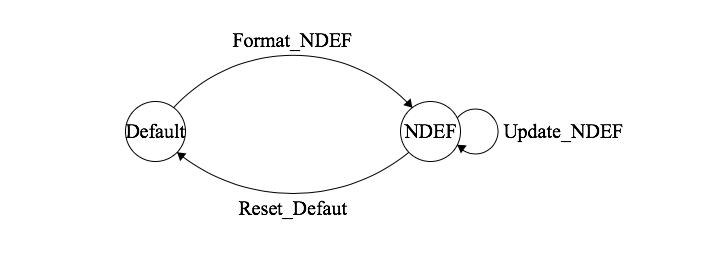

# NXP PN532 NFC Library for TI TM4C123GXL MCU

## Introduction
This repository contains the driver software for **NXP PN532 NFC controller** on **TI TM4C123GXL MCU** and some example projects based on the driver software.

## Documents
#### [TI TM4C123GXL Data Sheet](http://www.ti.com/lit/ds/symlink/tm4c123gh6pm.pdf)
#### [NXP PN532 Data Sheet](https://www.nxp.com/docs/en/nxp/data-sheets/PN532_C1.pdf)
#### [NXP PN532 User Manual](https://www.nxp.com/docs/en/user-guide/141520.pdf)
#### [Elechouse PN532 NFC RFID Module User Guide](https://dangerousthings.com/wp-content/uploads/PN532_Manual_V3-1.pdf)

## Supported PN532 Module
### Elechouse PN532 NFC RFID Module

### Adafruit PN532 NFC/RFID Controller Breakout Board

Other variations of PN532 boards are not tested for now (since I dont have them) but they should work, if wired correctly. 

## Supported Protocols
- [x] SSI/SPI: All SSI ports supported.
- [ ] I2C: In development.
- [ ] UART/HSU: In development.

## Installation
### Keil uVision 
 I include Keil uVision project file (the uvproj file in each project folder) so that if you are using ARM Keil uVision with your TM4C123G, you can just double click on the uVision project file and load to your MCU. 
 
 ### GCC
 Please refer to my [zEEware repo](https://github.com/zeelivermorium/zeeware) for intallation guide for running TM4C123GXL projects via GCC.
 
 ### Other Methods
 If you are not using methods above, you will need to organize all the source files by yourself.
 
## API
Driver APIs please refer to [PN532.h](lib/PN532/inc/PN532.h). There are only 2 low level R/W APIs, *writeCommand* and *readResponse*. Regardless what protocol you are using, the APIs called by [PN532.c](lib/PN532/src/PN532.c) are the same. This is achived by the preprocessor setting in [PN532_Setting.h](lib/PN532/inc/PN532_Setting.h). These setting not only enables users to turn on only the certain comunication protocol (SSI, I2C and HSU), but also prevents from including the code for unused protocols (when SSI is used, only SSI code is included). This approach significantly reduces code size loaded into the precious ROM space on TM4C123GXL and allows reusable R/W APIs across all protocols.

## Projects

### Reader/Writer Mode (PCD)

#### **ISO14443A Card Detection**
#### [ISO14443A Detect](proj/PN532_PCD_ISO14443A_Detect)
> Detect an ISO14443A card and send its UID to serial output (UART via USB).

#### [ISO14443A Detect ST7735](proj/PN532_PCD_ISO14443A_Detect_ST7735)
> Detect an ISO14443A card and output its UID to an [ST7735](https://www.adafruit.com/product/358) LCD.

#### **Mifare Classic**

#### [MifareClassic Format NDEF](proj/PN532_PCD_MifareClassic_Format_NDEF)
> Format a Mifare Classic card from default format to NDEF format with customized content.

#### [MifareClassic Update NDEF](proj/PN532_PCD_MifareClassic_Update_NDEF)
> Update the content in a NDEF formatted Mifare Classic card.

#### [MifareClassic Reset Default](proj/PN532_PCD_MifareClassic_Reset_Default)
> Format a NDEF formatted Mifare Classic card to its default format.

#### [MifareClassic Memory Dump](proj/PN532_PCD_MifareClassic_Memory_Dump)
> Dump all memory content of a Mifare Classic card.

### Card Emulation (PICC)
#### [Card Emulation](proj/PN532_PICC_Emulate)
> Emulate PN532 as a NDEF card.

### Peer to Peer
#### [Color_Swap_ST7735_Initiator](proj/PN532_P2P_Color_Swap_ST7735_Initiator)
> The initiator of a peer to peer color (displayed on ST7735) exchange between 2 PN532.

#### [Color_Swap_ST7735_Target](proj/PN532_P2P_Color_Swap_ST7735_Target)
> The Target of a peer to peer color (displayed on ST7735) exchange project 2 PN532.

## Problems and Bugs
If you find any bug or problem, please create new issue or a pull request with a fix in the repository.
Or you can simply email me about the problem or bug at zeelivermorium@gmail.com .
Much Appreciated!

## Copyright Note
This repository adpated and modified some source code from [Seeed Studio's PN532 Arduino driver](https://github.com/Seeed-Studio/PN532) and some peer to peer example source code from Elechouse (code not on github, but you can download from their manual linked in the documents section above). Some addtional files necessary [ValvanoWareTM4C123](http://edx-org-utaustinx.s3.amazonaws.com/UT601x/ValvanoWareTM4C123.zip?dl=1) for TM4C123GXL to run, by [Dr. Jonathan Valvano](http://users.ece.utexas.edu/~valvano/), are also included. 
